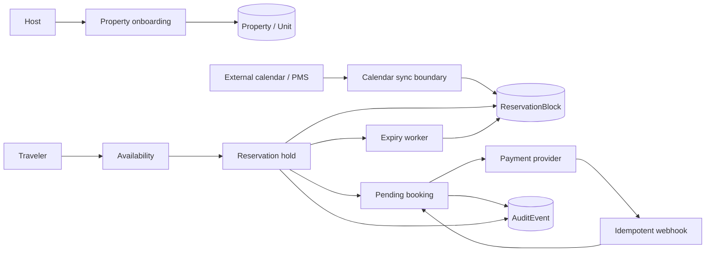

# Bluepina Booking Core + Host Onboarding

A focused proof-of-work exploring one of the hardest early marketplace problems: **keeping availability trustworthy while hosts, travelers, payment providers, and external calendars all write state at different times.**

## What is implemented

- **Host onboarding**: create a property and its first bookable unit.
- **Availability reads**: inspect which nights are free or blocked.
- **15-minute reservation holds**: claim nights before collecting payment.
- **Database-level double-booking protection**: PostgreSQL decides which concurrent hold wins.
- **Idempotent hold creation**: network retries return the same hold.
- **Pending booking creation**: convert an active hold into a payable booking.
- **Idempotent payment webhooks**: provider retries do not repeat state transitions.
- **Hold expiry/release**: expired inventory can safely return to availability.
- **External calendar boundary**: import busy ranges without silently overwriting local reservations.
- **Audit events**: preserve a basic operational trail before introducing distributed infrastructure.
- **Small Next.js reviewer UI**: traveler flow, host flow, and an architecture walkthrough.

## The central invariant

A room cannot be sold twice for the same night.

The naive implementation is:

1. Query whether dates are available.
2. If yes, create a reservation.

That fails under concurrency because two requests can both read "available" before either writes.

This project instead stores one `ReservationBlock` per occupied unit/night and gives PostgreSQL a unique constraint:

```text
@@unique([unitId, date])
```

Creating a hold and claiming all requested nights happens in **one database transaction**. If another request owns even one of those nights, PostgreSQL rejects the conflicting insert and the entire hold rolls back.

The availability endpoint is therefore useful for UX, but it is **not trusted as the final booking authority**.

## Why this scope

For an early marketplace onboarding its first properties, the difficult failures are unlikely to start with CPU or query throughput. They are more likely to be:

- stale iCal/PMS data;
- two systems claiming the same inventory;
- duplicate payment-provider callbacks;
- clients retrying requests after a timeout;
- support staff not knowing why a date became unavailable;
- payment state disagreeing with booking state.

The implementation therefore spends complexity on **correctness, idempotency, source attribution, and auditability** before microservices or event-bus infrastructure.

## Repository

```text
apps/
  api/                 NestJS + Prisma + PostgreSQL
    prisma/schema.prisma
    src/booking/       holds, bookings, payment transitions
    src/calendar/      external availability boundary
    src/host/          property onboarding
  web/                 Next.js App Router reviewer UI
packages/
  contracts/           small shared domain contract package
docs/
  architecture.md      tradeoffs, failure modes, evolution path
scripts/
  demo.sh              end-to-end API walkthrough
```

## Architecture



See [`docs/architecture.md`](docs/architecture.md) for the decision record.

## Run locally

### Requirements

- Node.js 20+
- pnpm
- Docker

### 1. Install

```bash
pnpm install
cp .env.example .env
```

### 2. Start PostgreSQL

```bash
docker compose up -d postgres
```

### 3. Generate and migrate

```bash
pnpm db:generate
pnpm db:migrate
pnpm db:seed
```

The seed command prints a sample `unit.id`. Copy it for the booking demo.

### 4. Start the apps

```bash
pnpm dev
```

- Web: http://localhost:3000
- API: http://localhost:4000/v1/health

## Five-minute reviewer path

If you only have five minutes:

1. Read the **central invariant** above.
2. Open `apps/api/prisma/schema.prisma` and find `@@unique([unitId, date])`.
3. Read `BookingService.createHold()` to see the transaction boundary.
4. Read `BookingService.processPayment()` for webhook idempotency and booking-state transitions.
5. Read `docs/architecture.md`, especially **What breaks first at 100 properties?**

## Example flow

### Create a hold

```bash
curl -X POST http://localhost:4000/v1/holds \
  -H 'content-type: application/json' \
  -d '{
    "unitId": "<seeded-unit-id>",
    "checkIn": "2026-10-10",
    "checkOut": "2026-10-13",
    "idempotencyKey": "demo-hold-001"
  }'
```

Submitting the same request with the same idempotency key returns the original hold. Submitting a different hold over any claimed night returns `409 Conflict`.

### Create the pending booking

```bash
curl -X POST http://localhost:4000/v1/bookings \
  -H 'content-type: application/json' \
  -d '{
    "holdId": "<hold-id>",
    "guestName": "Alex Rivera",
    "guestEmail": "alex@example.com"
  }'
```

### Simulate a successful payment callback

```bash
curl -X POST http://localhost:4000/v1/payments/webhook \
  -H 'content-type: application/json' \
  -d '{
    "eventId": "evt-demo-001",
    "bookingId": "<booking-id>",
    "providerRef": "pay-demo-001",
    "status": "SUCCEEDED"
  }'
```

Sending the same `eventId` again is safe and returns a duplicate result without replaying the state transition.

## API surface

| Method | Endpoint | Purpose |
|---|---|---|
| `GET` | `/v1/health` | service health |
| `GET` | `/v1/availability` | view date-level availability |
| `POST` | `/v1/host/onboard` | create a property + first unit |
| `GET` | `/v1/host/properties` | reviewer-friendly property listing |
| `POST` | `/v1/holds` | transactionally claim nights |
| `POST` | `/v1/holds/reap-expired` | release expired holds |
| `POST` | `/v1/bookings` | create a pending-payment booking |
| `POST` | `/v1/payments/webhook` | idempotently update payment state |
| `POST` | `/v1/calendar/sync` | import external busy ranges |

## What I deliberately did not build

A proof-of-work can become less useful when it pretends to be a finished startup. These are intentionally left behind clear boundaries rather than mocked as production-ready features:

- authentication and host/property authorization;
- a real payment-provider adapter and signature verification;
- iCal parsing / PMS integrations;
- taxes, fees, cancellation policy, refunds and multi-currency settlement;
- scheduled workers and job queues;
- search/ranking and recommendation systems;
- production observability and alerting;
- image/media pipelines;
- full traveler/host product UI.

## If this went to production next

My next engineering sequence would be:

1. **Identity + property-scoped authorization** so host data boundaries are explicit.
2. **Real payment adapter** with signature verification, reconciliation, and operational states beyond success/failure.
3. **Background worker** for hold expiry and calendar synchronization.
4. **Calendar health model**: last successful sync, lag, malformed events, conflict resolution.
5. **Pricing/fees/cancellation domain** before expanding checkout UX.
6. **Observability** around booking conversion, hold expiry, payment mismatch, and calendar lag.
7. Only then split components if usage or team ownership creates a real reason to distribute the system.

## A note on product judgment

The goal of this repository is not to claim knowledge of Bluepina's private architecture. It is an independent exercise based on the public product and role description. The choices here are meant to be discussable: I would expect several of them to change after seeing actual product constraints, existing code, host workflows, and integration partners.

That willingness to replace an elegant hypothetical design with the simplest design supported by real evidence is part of the point.
