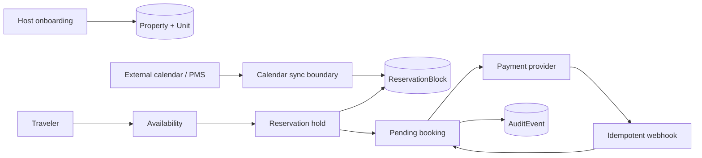

# Architecture notes

## Product slice

This proof of work models the smallest booking core that can survive real concurrency:

## Why date-level reservation blocks?

A marketplace cannot treat availability as a boolean cached on a room. Two travelers can attempt the same dates concurrently, while external calendars may also mark dates unavailable. The write path therefore claims each night as a database row with a unique `(unitId, date)` constraint.

A hold is created and all required date rows are inserted in the **same PostgreSQL transaction**. If one row already exists, PostgreSQL rejects the write and the entire hold is rolled back. The database is the final concurrency authority.

This design is intentionally simple for an early-stage product. At larger scale, it can evolve toward inventory buckets, advisory locks, or a specialized availability service without changing the public booking semantics.

## Idempotency boundaries

- Hold requests accept an `idempotencyKey`. Retrying a mobile/network request returns the same hold.
- Payment webhooks accept a provider `eventId`, stored uniquely before state transition. Re-delivery is safe.
- External calendar events use stable external references so re-syncs do not duplicate state.

## Failure cases explicitly handled

1. Two travelers request overlapping dates at the same instant → unique constraint chooses one winner.
2. Traveler retries hold creation after timeout → same idempotency key returns original hold.
3. Payment provider sends the same webhook repeatedly → duplicate event is ignored.
4. Hold expires before payment → reaper marks it expired and releases its date blocks.
5. External calendar blocks a date already held/booked → sync reports a conflict instead of overwriting local truth.

## What breaks first at 100 properties?

Not raw database throughput. The first operational problems are more likely to be **availability correctness and integration drift**:

- iCal feeds can be delayed, duplicated, or malformed.
- Properties may expose several calendars for the same physical inventory.
- Hosts will need visibility into why a date is unavailable.
- Support needs an audit trail before the team needs microservices.

For that reason this slice prioritizes explicit source attribution on blocks, stable idempotency keys, and an audit-event table before introducing extra infrastructure.

## Next production steps

- Authentication + property-scoped authorization.
- Payment-provider signature verification and secret rotation.
- Scheduled hold expiry worker.
- Real iCal parser / PMS adapters behind the calendar boundary.
- Pricing rules, taxes, fees, and multi-currency settlement.
- Observability: structured logs, traces, SLOs, sync-lag metrics.
- Host-facing conflict resolution and calendar health.
